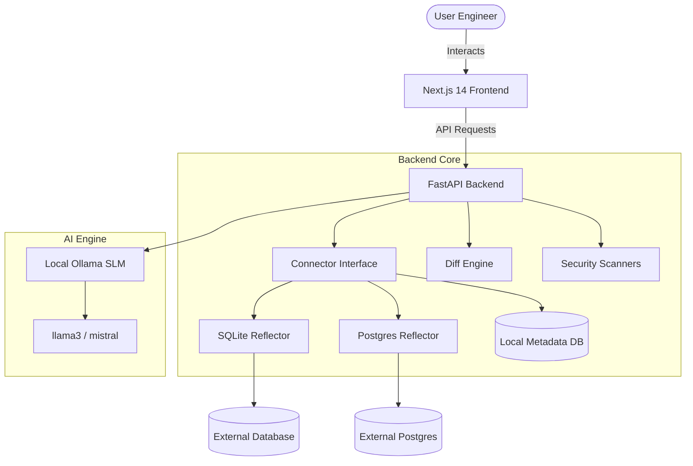

# dataPlane ✈️

**An AI-First, Agentic Database Engineering & Data Transformation Platform**

---

## 🌟 Product Vision
dataPlane is built to manage heterogeneous data systems intelligently with AI. It acts as an **Agentic DBA** finding matches, mapping structures, creating pipelines, and auditing security classifications safely at enterprise scale.

---

## 🏗️ Architecture
dataPlane utilizes a decoupled system with local LLM assistance for metadata analysis:



---

## 🚀 Key Features

*   **🔌 Smart Connectors**: Unified interface for SQLite/Postgres schemas structural reflections securely.
*   **🧠 AI Matcher**: Semantic column alignment suggesting structural cast logic maps powered by local LLMs (`Ollama`).
*   **⚡ Visual Pipelines Stage**: Fully interactive **React Flow** node boards visualizing sync diagrams pipelines securely correctly.
*   **🛡️ Data classification Command Center**: Continuous auditors scanning indices classifications auto-tagging PII fields levels correctly.

---

## 🛠️ Setup & Run

The platform relies on **Docker Compose** orchestrating stateful configurations easily:

### 1. Prerequisite
Ensure Docker and Docker Compose are installed on your system.

### 2. Start Services
Run following command at root directory path triggers absolute updates:
```bash
docker-compose up -d --build
```

### 3. Navigation Endpoints
| Component | URL |
| :--- | :--- |
| **Frontend UI Studio** | `http://localhost:3000` |
| **FastAPI Automated Docs** | `http://localhost:8000/docs` |
| **Ollama Local LLM Endpoint** | `http://localhost:11434` |

---

## 📖 User Guidance

1.  **Dashboard**: Active overviews metrics connected triggers pipelines state.
2.  **Connectors**: Click **New Connector** adding parameters configurations list.
3.  **Schema Canvas**: Align dynamic structural diff datasets interactively drag elements triggers safely.
4.  **Autopilot**: Enable triggers modeling continuous AI simulations pipelines mappings accurately layouts securely properly.

---
*Created with ❤️ powered by Advanced Agentic Code.*
