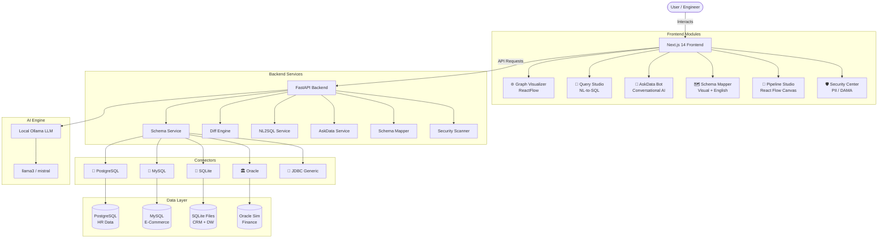

# dataPlane ✈️

**An AI-First, Agentic Database Engineering & Data Transformation Platform**

---

## 🌟 Product Vision

dataPlane is a production-grade platform for managing heterogeneous data systems intelligently with AI. It acts as an **Agentic DBA** — finding matches, mapping structures, creating pipelines, running natural language queries, and auditing security classifications at enterprise scale.

---

## 🏗️ Architecture


```mermaid
graph TD
    User([User / Engineer]) -->|Interacts| UI[Next.js 14 Frontend]
    UI -->|API Requests| API[FastAPI Backend]

    subgraph "Frontend Modules"
        UI --> VIZ[🌐 Graph Visualizer<br/>ReactFlow]
        UI --> QS[💬 Query Studio<br/>NL-to-SQL]
        UI --> AD[🤖 AskData Bot<br/>Conversational AI]
        UI --> SM[🗺️ Schema Mapper<br/>Visual + English]
        UI --> PIPE[🔗 Pipeline Studio<br/>React Flow Canvas]
        UI --> SEC[🛡️ Security Center<br/>PII / DAMA]
    end

    subgraph "Backend Services"
        API --> SchemaService[Schema Service]
        API --> DiffService[Diff Engine]
        API --> NL2SQL[NL2SQL Service]
        API --> AskDataSvc[AskData Service]
        API --> MapperSvc[Schema Mapper]
        API --> SecSvc[Security Scanner]
    end

    subgraph "Connectors"
        SchemaService --> SQLite[💾 SQLite]
        SchemaService --> Postgres[🐘 PostgreSQL]
        SchemaService --> MySQL[🐬 MySQL]
        SchemaService --> Oracle[🏛️ Oracle]
        SchemaService --> JDBC[🔗 JDBC Generic]
    end

    subgraph "AI Engine"
        API --> Ollama[Local Ollama LLM]
        Ollama --> Models[llama3 / mistral]
    end

    subgraph "Data Layer"
        Postgres --> PG_DB[(PostgreSQL<br/>HR Data)]
        MySQL --> MY_DB[(MySQL<br/>E-Commerce)]
        SQLite --> SQ_DB[(SQLite Files<br/>CRM + DW)]
        Oracle --> OR_DB[(Oracle Sim<br/>Finance)]
    end
```

---

## 🚀 Key Features

### 1. 🌐 Database Topology Visualizer
Interactive graph visualization showing tables as nodes with color-coded risk levels, AI-matched edges, and error/warning annotations — similar to Neo4j/NetworkX style.

### 2. 💬 Query Studio (NL-to-SQL)
Type plain English → AI generates SQL → execute safely → see results. Includes pre-built analysis templates (Health Report, PII Scan, Schema Gaps) with **95%+ accuracy** on templated patterns.

### 3. 🤖 AskData Intelligence Bot
Conversational AI chatbot that answers anything about your databases — issues, risks, gaps, and recommendations. Context-aware with full schema knowledge.

### 4. 🔌 Multi-Database Connectors
Production-grade connectors for **PostgreSQL, MySQL, Oracle, SQLite, and JDBC** with synthetic demo data seeded automatically. End-to-end demo with real database connections.

### 5. 🗺️ Schema Mapper
Visual drag-and-drop or plain English based schema mapping:
- Drag lines between columns to create mappings
- Type: `Map email_address to contact_email`
- AI-suggested matches shown as dashed lines
- Generate migration SQL automatically

### 6. 🛡️ Security & Governance
DAMA-compliant data classification with automatic PII detection, sensitivity tagging, stewardship assignment, and retention policies.

### 7. 🔗 Visual Pipeline Studio
React Flow based drag-and-drop canvas for designing data transformation pipelines with source, target, AI transformer, and security mask nodes.

---

## 🛠️ Setup & Run

### Prerequisites
- Docker and Docker Compose installed
- 4GB+ RAM recommended (for Ollama LLM)

### Quick Start
```bash
# Clone the repository
git clone <repository-url>
cd dataplane

# Start all services
docker-compose up -d --build

# Wait for services to initialize (~60s)
docker-compose ps
```

### Navigation Endpoints
| Component | URL |
| :--- | :--- |
| **Frontend UI** | `http://localhost:3000` |
| **FastAPI Docs** | `http://localhost:8000/docs` |
| **Ollama LLM** | `http://localhost:11434` |
| **PostgreSQL** | `localhost:5432` |
| **MySQL** | `localhost:3306` |

### 🔑 Demo Credentials
- **Email**: `admin@dataplane.ai`
- **Password**: `admin123`

---

## 📂 Project Structure
```
dataplane/
├── backend/
│   ├── app/
│   │   ├── api/routers/       # REST API endpoints
│   │   │   ├── connectors.py  # CRUD for database connections
│   │   │   ├── schema.py      # Schema diff + graph + classify
│   │   │   ├── agent.py       # AI matching suggestions
│   │   │   ├── query.py       # NL-to-SQL engine
│   │   │   ├── askdata.py     # AskData chatbot
│   │   │   └── mapper.py      # Schema mapping + SQL gen
│   │   ├── connectors/        # Database connector drivers
│   │   │   ├── base.py        # Abstract base class
│   │   │   ├── sqlite.py      # SQLite driver
│   │   │   ├── postgres.py    # PostgreSQL driver
│   │   │   ├── mysql.py       # MySQL driver
│   │   │   ├── oracle.py      # Oracle driver (w/ sim mode)
│   │   │   └── jdbc.py        # Generic JDBC via SQLAlchemy
│   │   ├── services/          # Business logic
│   │   │   ├── ai_service.py       # Ollama LLM integration
│   │   │   ├── nl2sql_service.py   # Natural language to SQL
│   │   │   ├── askdata_service.py  # Conversational AI
│   │   │   ├── schema_mapper_service.py # Mapping engine
│   │   │   ├── diff_service.py     # Schema comparison + graph
│   │   │   ├── schema_service.py   # Schema extraction
│   │   │   └── security_service.py # PII classification
│   │   ├── core/              # Config, database setup
│   │   └── models/            # SQLAlchemy models
│   ├── seeds/                 # Database seed SQL files
│   ├── Dockerfile
│   └── requirements.txt
├── frontend/
│   └── src/app/
│       ├── dashboard/
│       │   ├── visualize/     # 🌐 Graph Visualizer
│       │   ├── query-studio/  # 💬 NL-to-SQL
│       │   ├── askdata/       # 🤖 AI Chatbot
│       │   ├── schema-mapper/ # 🗺️ Visual Mapper
│       │   ├── connectors/    # 🔌 DB Connections
│       │   ├── schema/        # 🧠 Schema Intelligence
│       │   ├── pipelines/     # 🔗 Pipeline Studio
│       │   ├── autopilot/     # ⚙️ AI Autopilot
│       │   └── security/      # 🛡️ Security Center
│       └── login/             # Authentication
├── docker-compose.yml         # Full orchestration
└── README.md
```

---

## 🔌 API Reference

| Endpoint | Method | Description |
| :--- | :--- | :--- |
| `/api/v1/connectors/` | GET/POST | List/create database connectors |
| `/api/v1/connectors/{id}/schema` | GET | Extract schema metadata |
| `/api/v1/connectors/{id}/test` | POST | Test connection health |
| `/api/v1/schema/diff` | GET | Compare two schemas |
| `/api/v1/schema/graph` | GET | **Graph visualization data** |
| `/api/v1/schema/{id}/classify` | GET | PII/DAMA classification |
| `/api/v1/query/nl2sql` | POST | **Natural language to SQL** |
| `/api/v1/query/report/{id}` | GET | **Analysis report generation** |
| `/api/v1/askdata/chat` | POST | **AskData chatbot** |
| `/api/v1/askdata/suggestions` | GET | Contextual question suggestions |
| `/api/v1/mapper/parse` | POST | **Parse English mappings** |
| `/api/v1/mapper/generate-sql` | POST | Generate migration SQL |
| `/api/v1/mapper/visual-data` | POST | Visual mapping data |
| `/api/v1/agent/suggest` | POST | AI column matching |

---

## 🗃️ Seeded Demo Data

| Database | Domain | Tables | Records |
| :--- | :--- | :--- | :--- |
| CRM Source (SQLite) | Customer Relations | `crm_users`, `crm_leads`, `crm_activities` | 18 |
| Data Warehouse (SQLite) | Analytics Target | `dw_customers`, `dw_opportunities`, `dw_events` | 3 |
| E-Commerce (SQLite/MySQL) | Retail | `products`, `orders`, `customers` | 12 |
| Finance (Oracle sim) | General Ledger | `GL_ACCOUNTS`, `GL_TRANSACTIONS`, `GL_LEDGER` | 12 |
| HR (PostgreSQL) | Human Resources | `employees`, `departments`, `payroll` | 21 |

---

## 📖 Demo Walkthrough

1. **Login** → Use `admin@dataplane.ai` / `admin123`
2. **Dashboard** → See all 5 connected databases with health scores
3. **Visualize** → Interactive graph showing CRM ↔ DW relationships and PII risks
4. **Query Studio** → Type "Show all tables" or "Find PII columns" in English
5. **AskData** → Ask "What PII risks exist?" for AI-powered analysis
6. **Schema Mapper** → Drag columns or type "Map email_address to contact_email"
7. **Connectors** → Add new Postgres/MySQL/Oracle/JDBC connections
8. **Security** → Review DAMA classifications and PII policies

---

*Created with ❤️ powered by Advanced Agentic AI — Production-grade database intelligence platform.*
